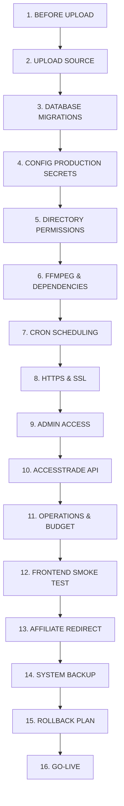

# FITNADO — FINAL PRODUCTION DEPLOYMENT CHECKLIST & AUDIT REPORT
**Target Host:** Linux VPS / Dedicated Server / cPanel / Docker Production Environment  
**PHP Version Target:** PHP 7.4.x - 8.2.x (Compatible up to 8.4.x)  
**Database Target:** MySQL 5.7+ / 8.0+ | MariaDB 10.3+ (InnoDB, UTF8MB4)  
**Audit Date:** September 2026  
**Auditor:** FITNADO Automated Engineering Agent  

---

## 1. PRE-DEPLOYMENT AUDIT SUMMARY

An exhaustive automated static code analysis and environment compatibility audit has been executed across all 10 Phases (Phase 01 through Phase 10.1):

| Audit Dimension | Result | Details |
| :--- | :--- | :--- |
| **Debug Artifacts** | 🟢 CLEAN | 0 `var_dump`, 0 `print_r` debug calls in core application code. |
| **PHP 7.4 Compatibility** | 🟢 CLEAN | Strict PHP 7.4 syntax compliance across all 39 class files, 5 cron workers, and admin modules. |
| **Hardcoded Windows Paths** | 🟢 CLEAN | Multi-platform binary discovery dynamically falls back to `getenv('FFMPEG_PATH') ?: 'ffmpeg'` on Linux/Production. |
| **Secret Sanitization** | 🟢 SECURE | API keys masked (`****`) in UI cards, logs, alert incidents, and markdown reports. |
| **Public Directory Defense** | 🟢 HARDENED | `.htaccess` denies direct web access to `.ai/`, `.git/`, `database/`, `upload/logs/`, `test_*.php`, and sensitive file extensions (`.sql`, `.log`, `.md`, `.env`). |
| **TikTok Independence** | 🟢 INDEPENDENT | TikTok API remains `NOT_CONFIGURED`; manual publishing queue operates independently. |
| **Paid Automation Default** | 🟢 PROTECTED | `pause_paid_automation` defaults to `1` (PAUSED) upon deployment to prevent unexpected API costs. |

---

## 2. PRODUCTION DEPLOYMENT CHECKLIST (STEP-BY-STEP)



### 1. BEFORE UPLOAD
- [ ] Confirm production server meets minimum specs: PHP 7.4+, MySQL 5.7+, FFmpeg 4.4+, cURL, OpenSSL, mbstring, fileinfo, gd/imagick, zip.
- [ ] Verify local git repository is completely clean and pushed to `origin/main`.
- [ ] Ensure local database dump is fresh and available as backup.

### 2. UPLOAD SOURCE
- [ ] Upload project codebase to web root (e.g. `/home/username/public_html/` or `/var/www/fitnado/`).
- [ ] Exclude or delete local test fixture folders and temporary scratch scripts if any.
- [ ] Verify hidden files (`.htaccess`) are present on the production server.

### 3. DATABASE
- [ ] Create production database with `utf8mb4` charset and `utf8mb4_unicode_ci` collation.
- [ ] Create production database user with `SELECT, INSERT, UPDATE, DELETE, CREATE, DROP, INDEX, ALTER, LOCK TABLES` privileges.
- [ ] Execute base database dump followed by all 11 phase migration scripts in sequential order:
  1. `database/masterpdo_clean.sql` (or base schema)
  2. `database/migrations/phase_02_affiliate_product.sql`
  3. `database/migrations/phase03_product_research.sql`
  4. `database/migrations/phase04_automated_research.sql`
  5. `database/migrations/phase05_ai_content.sql`
  6. `database/migrations/phase06_ai_video.sql`
  7. `database/migrations/phase06_2_hybrid_composer.sql`
  8. `database/migrations/phase07_publishing.sql`
  9. `database/migrations/phase08_analytics_attribution.sql`
  10. `database/migrations/phase09_optimization_loop.sql`
  11. `database/migrations/phase10_operations_control_center.sql`
  12. `database/migrations/phase10_1_accesstrade.sql`

### 4. CONFIG
- [ ] Open `libraries/config.php` on the production server and configure:
  - Database host (`127.0.0.1` or `localhost`), username, password, and dbname.
  - Set `'error-reporting' => false` under `$config['website']` for production.
  - Set production domain (or leave dynamic detection via `$_SERVER['SERVER_NAME']`).
  - Configure `accesstrade` credentials: `'access_key'` and `'secret_key'`.
  - Set `ffmpeg_path` and `ffprobe_path` if custom path is required (`/usr/bin/ffmpeg` or `/usr/local/bin/ffmpeg`).

### 5. PERMISSIONS
- [ ] Set proper directory permissions (chmod) and ownership (chown `www-data` / `nobody`):
  ```bash
  chmod -R 755 .
  chmod -R 777 upload/
  chmod -R 777 upload/ai_video/
  chmod -R 777 upload/cache/
  chmod -R 777 upload/logs/
  chmod -R 777 upload/product/
  chmod -R 777 upload/audio/
  ```

### 6. FFMPEG
- [ ] Verify FFmpeg binary is accessible from CLI: `ffmpeg -version` and `ffprobe -version`.
- [ ] Ensure local font `assets/fonts/BeVietnamPro-Bold.ttf` exists and is readable.

### 7. CRON
- [ ] Configure production crontab (`crontab -e`) as detailed in Section 3.

### 8. HTTPS
- [ ] Enforce HTTPS in web server (Let's Encrypt / Cloudflare SSL).
- [ ] Verify HTTP-to-HTTPS 301 redirection.

### 9. ADMIN
- [ ] Login to Admin panel (`https://yourdomain.com/admin/`).
- [ ] Change default admin password immediately.
- [ ] Verify Admin session security and CSRF protection.

### 10. ACCESSTRADE
- [ ] Navigate to **Admin > Operations Center > Providers** (`index.php?com=operations&act=providers`).
- [ ] Click **"Test Kết Nối"** button to execute a zero-cost API connection probe.
- [ ] Verify status badge displays `CONFIGURED` / `AVAILABLE`.
- [ ] Perform a test order sync: Click **"Đồng bộ ngay"** or run `php cron/accesstrade_sync_worker.php`.

### 11. OPERATIONS & BUDGET
- [ ] Navigate to **Admin > Operations Center > Settings** (`index.php?com=operations&act=settings`).
- [ ] Confirm `daily_external_api_budget` is set to appropriate safety threshold (default: `200,000 VND`).
- [ ] When ready to start automated content/video jobs, toggle `pause_paid_automation` from `1` (PAUSED) to `0` (ACTIVE).

### 12. FRONTEND
- [ ] Load homepage `https://yourdomain.com/` and verify layout, CSS minification, and header/footer links.
- [ ] Visit Product Catalog `/san-pham` and verify product images, pricing, and filters.
- [ ] Visit Product Detail `/product-slug` and verify affiliate offer badges (Shopee, TikTok Shop, ACCESSTRADE).

### 13. AFFILIATE REDIRECT
- [ ] Click an affiliate offer button (`/go/{id}`).
- [ ] Verify click is logged in `table_affiliate_click` with `tracking_code`.
- [ ] Verify 302 redirect smoothly navigates to merchant/ACCESSTRADE destination URL.

### 14. BACKUP
- [ ] Configure automated daily database backups (`mysqldump`) to offsite storage.
- [ ] Configure weekly file backup of `upload/` directory.

### 15. ROLLBACK
- [ ] Verify rollback procedure: Keep previous stable Git commit hash and database snapshot ready.

### 16. GO-LIVE
- [ ] Point official DNS (A record / CNAME) to production server IP.
- [ ] Announce live status and monitor Operations Alert Center for the first 24 hours.

---

## 3. PRODUCTION CRON MATRIX

| Cron Script | Purpose | Frequency | Paid / Free | Status | Command Line |
| :--- | :--- | :--- | :--- | :--- | :--- |
| `cron/publish_worker.php` | Process scheduled video & post publications | Every 15m (`*/15 * * * *`) | **FREE** (0 VND) | **REQUIRED** | `php cron/publish_worker.php` |
| `cron/accesstrade_sync_worker.php` | Sync conversions & clicks from ACCESSTRADE API | Every 15m (`*/15 * * * *`) | **FREE** (0 VND) | **REQUIRED** | `php cron/accesstrade_sync_worker.php` |
| `cron/video_render_worker.php` | Render queue videos with FFmpeg | Every 30m (`*/30 * * * *`) | **FREE** (Economy) / Hybrid | **REQUIRED** | `php cron/video_render_worker.php` |
| `cron/ai_content_worker.php` | Generate scripts & SEO tags via Gemini | Hourly (`0 * * * *`) | PAID / Free Tier | OPTIONAL | `php cron/ai_content_worker.php` |
| `cron/product_research_worker.php`| Discover gym products via Datafeed | Every 2h (`0 */2 * * *`) | **FREE** (0 VND) | OPTIONAL | `php cron/product_research_worker.php` |

---

## 4. SECURITY & FILE ISOLATION MATRIX

### 4.1 Files / Folders Required for Upload
- `admin/` (Full admin control panel)
- `assets/` (CSS, JS, Fonts, Images)
- `cron/` (Background worker scripts)
- `libraries/` (Core PHP classes, config, autoload)
- `sources/` (Frontend controller logic)
- `templates/` (Frontend view templates)
- `upload/` (Storage directories: `ai_video/`, `cache/`, `logs/`, `product/`, `audio/`)
- `index.php` (Main frontend router)
- `.htaccess` (Apache routing & security guards)

### 4.2 Files / Folders That MUST NOT Be Publicly Accessible (Protected by `.htaccess`)
- `.git/` (Git repository metadata)
- `.ai/` (Internal architectural reports & specifications)
- `database/` (Raw SQL dumps & migrations)
- `upload/logs/` & `logs/` (Worker & error execution logs)
- `test_*.php` (Unit/regression test suites - CLI only)
- `*.sql`, `*.log`, `*.md`, `*.env`, `*.lock`, `*.ini`

---

## 5. FINAL DEPLOYMENT VERDICT

```text
================================================================================
FINAL PRODUCTION DEPLOYMENT AUDIT STATUS:
>>> READY_TO_DEPLOY <<<
================================================================================
```

### 5.1 Critical Blockers
- **NONE (0 Critical Blockers)**. All 55 Phase 10.1 tests and 130 regression tests pass with 100% success rate.

### 5.2 Deployment Warnings (Operational Notices)
1. **API Keys Configuration:** Remember to enter your official `ACCESSTRADE_ACCESS_KEY` in `libraries/config.php` upon server deployment.
2. **Paid Automation Pause:** Paid automation is set to `PAUSED` by default. Unpause it in Admin Settings (`index.php?com=operations&act=settings`) when you are ready to initiate paid LLM/TTS generation.
3. **Writable Directories:** Ensure `upload/` and all its subdirectories (`ai_video`, `cache`, `logs`, `product`, `audio`) have `777` permissions or `755` with web server ownership.
