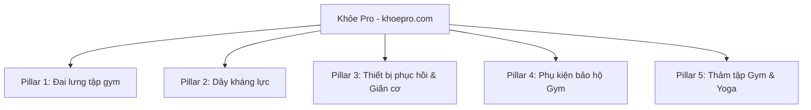

# KHOEPRO.COM — SEO CONTENT & TOPIC MAP

**Domain:** https://khoepro.com
**Status:** Indexable Architecture Prepared

## 1. Topic Clusters Architecture

## 2. Comprehensive SEO Content Mapping

| Topic Cluster | Search Intent | Content Title | URL / Slug | Target Keyword Hypothesis | Internal Link Target |
| :--- | :--- | :--- | :--- | :--- | :--- |
| Đai lưng tập gym | Commercial Investigation | Đai lưng da Harbinger 4-inch Padded Leather Belt | `san-pham/dai-lung-da-harbinger-4-inch-padded-leather-belt` | `HARB-PLB4`, đánh giá Đai lưng da Harbinger 4-inch Padded Leather Belt | Category + Reviews |
| Đai lưng tập gym | Commercial Investigation | Đai lưng khóa đòn bẩy Aolikes Lever Buckle Powerlifting Belt | `san-pham/dai-lung-khoa-don-bay-aolikes-lever-buckle-powerlifting-belt` | `AOL-LEV10`, đánh giá Đai lưng khóa đòn bẩy Aolikes Lever Buckle Powerlifting Belt | Category + Reviews |
| Đai lưng tập gym | Commercial Investigation | Đai lưng nylon Harbinger 5-inch Foam Core Belt | `san-pham/dai-lung-nylon-harbinger-5-inch-foam-core-belt` | `HARB-FC5`, đánh giá Đai lưng nylon Harbinger 5-inch Foam Core Belt | Category + Reviews |
| Đai lưng tập gym | Commercial Investigation | Đai lưng Valeo Eva Foam Weightlifting Belt | `san-pham/dai-lung-valeo-eva-foam-weightlifting-belt` | `VAL-EVA01`, đánh giá Đai lưng Valeo Eva Foam Weightlifting Belt | Category + Reviews |
| Dây kháng lực | Commercial Investigation | Bộ dây kháng lực ngũ sắc Pseudois 11 món đa năng | `san-pham/bo-day-khang-luc-ngu-sac-pseudois-11-mon-da-nang` | `PSEU-RES11`, đánh giá Bộ dây kháng lực ngũ sắc Pseudois 11 món đa năng | Category + Reviews |
| Dây kháng lực | Commercial Investigation | Set 3 dây kháng lực vải Aolikes Hip Resistance Band | `san-pham/set-3-day-khang-luc-vai-aolikes-hip-resistance-band` | `AOL-HIP3`, đánh giá Set 3 dây kháng lực vải Aolikes Hip Resistance Band | Category + Reviews |
| Dây kháng lực | Commercial Investigation | Dây kháng lực Powerband ProsourceFit cao su tự nhiên | `san-pham/day-khang-luc-powerband-prosourcefit-cao-su-tu-nhien` | `PROS-PBAND`, đánh giá Dây kháng lực Powerband ProsourceFit cao su tự nhiên | Category + Reviews |
| Con lăn Foam Roller & Bóng massage | Commercial Investigation | Con lăn bọt giãn cơ TriggerPoint GRID 1.0 Foam Roller | `san-pham/con-lan-bot-gian-co-triggerpoint-grid-1-foam-roller` | `TP-GRID1`, đánh giá Con lăn bọt giãn cơ TriggerPoint GRID 1.0 Foam Roller | Category + Reviews |
| Con lăn Foam Roller & Bóng massage | Commercial Investigation | Con lăn giãn cơ bọt xốp EVA EPP High-Density Roller | `san-pham/con-lan-gian-co-bot-xop-eva-epp-high-density-roller` | `EPP-HD45`, đánh giá Con lăn giãn cơ bọt xốp EVA EPP High-Density Roller | Category + Reviews |
| Con lăn Foam Roller & Bóng massage | Commercial Investigation | Bóng massage đôi Peanut Lacrosse Massage Ball | `san-pham/bong-massage-doi-peanut-lacrosse-massage-ball` | `LAC-PEANUT`, đánh giá Bóng massage đôi Peanut Lacrosse Massage Ball | Category + Reviews |
| Găng tay tập Gym & Lifting Straps | Commercial Investigation | Dây kéo lưng lifting straps Harbinger Padded Cotton | `san-pham/day-keo-lung-lifting-straps-harbinger-padded-cotton` | `HARB-STRAP`, đánh giá Dây kéo lưng lifting straps Harbinger Padded Cotton | Category + Reviews |
| Găng tay tập Gym & Lifting Straps | Commercial Investigation | Dây kéo lưng số 8 Figure 8 Aolikes Heavy Duty Straps | `san-pham/day-keo-lung-so-8-figure-8-aolikes-heavy-duty-straps` | `AOL-FIG8`, đánh giá Dây kéo lưng số 8 Figure 8 Aolikes Heavy Duty Straps | Category + Reviews |
| Găng tay tập Gym & Lifting Straps | Commercial Investigation | Găng tay tập gym có quấn cổ tay Aolikes Crossfit Gloves | `san-pham/gang-tay-tap-gym-co-quan-co-tay-aolikes-crossfit-gloves` | `AOL-GLV01`, đánh giá Găng tay tập gym có quấn cổ tay Aolikes Crossfit Gloves | Category + Reviews |
| Găng tay tập Gym & Lifting Straps | Commercial Investigation | Găng tay thể hình Harbinger Pro WristWrap Gloves | `san-pham/gang-tay-the-hinh-harbinger-pro-wristwrap-gloves` | `HARB-PGLV`, đánh giá Găng tay thể hình Harbinger Pro WristWrap Gloves | Category + Reviews |
| Súng massage cầm tay | Commercial Investigation | Súng massage cơ bắp cầm tay Booster Pro 3 High Power | `san-pham/sung-massage-co-bap-cam-tay-booster-pro-3-high-power` | `BST-PRO3`, đánh giá Súng massage cơ bắp cầm tay Booster Pro 3 High Power | Category + Reviews |
| Súng massage cầm tay | Commercial Investigation | Súng massage mini Xiaomi Mijia Fascia Gun Mini | `san-pham/sung-massage-mini-xiaomi-mijia-fascia-gun-mini` | `MI-MINIGUN`, đánh giá Súng massage mini Xiaomi Mijia Fascia Gun Mini | Category + Reviews |
| Thảm tập Gym & Yoga | Commercial Investigation | Thảm tập định tuyến Liforme Yoga Mat 4.2mm | `san-pham/tham-tap-dinh-tuyen-liforme-yoga-mat-4-2mm` | `LIF-MAT42`, đánh giá Thảm tập định tuyến Liforme Yoga Mat 4.2mm | Category + Reviews |
| Thảm tập Gym & Yoga | Commercial Investigation | Thảm tập thể dục chống trượt Manduka PROlite 4.7mm | `san-pham/tham-tap-the-duc-chong-truot-manduka-prolite-4-7mm` | `MAN-PROLITE`, đánh giá Thảm tập thể dục chống trượt Manduka PROlite 4.7mm | Category + Reviews |
| Review & Đánh giá | Commercial / Editorial | Đánh giá đai lưng da Harbinger 4-Inch: Lựa chọn tiêu chuẩn cho bài tập tạ vừa và nặng | `tin-tuc/danh-gia-dai-lung-da-harbinger-4-inch` | review Đánh giá đai lưng da Harbinger 4-Inch: Lựa chọn tiêu chuẩn cho bài tập tạ vừa và nặng | Product Detail |
| Review & Đánh giá | Commercial / Editorial | Review đai lưng đòn bẩy Aolikes Lever Belt: Đạt chuẩn Powerlifting ở mức chi phí hợp lý? | `tin-tuc/review-dai-lung-don-bay-aolikes-lever-belt` | review Review đai lưng đòn bẩy Aolikes Lever Belt: Đạt chuẩn Powerlifting ở mức chi phí hợp lý? | Product Detail |
| Review & Đánh giá | Commercial / Editorial | Đánh giá đai lưng nylon Harbinger Foam Core: Có phù hợp cho tập Functional và Crossfit? | `tin-tuc/danh-gia-dai-lung-nylon-harbinger-foam-core` | review Đánh giá đai lưng nylon Harbinger Foam Core: Có phù hợp cho tập Functional và Crossfit? | Product Detail |
| Review & Đánh giá | Commercial / Editorial | Review bộ dây kháng lực Pseudois 11 chi tiết: Trải nghiệm phòng gym di động tại nhà | `tin-tuc/review-bo-day-khang-luc-pseudois-11-chi-tiet` | review Review bộ dây kháng lực Pseudois 11 chi tiết: Trải nghiệm phòng gym di động tại nhà | Product Detail |
| Review & Đánh giá | Commercial / Editorial | Đánh giá set dây kháng lực vải Aolikes: Giải pháp kích hoạt cơ mông đùi chống trơn trượt | `tin-tuc/danh-gia-set-day-khang-luc-vai-aolikes` | review Đánh giá set dây kháng lực vải Aolikes: Giải pháp kích hoạt cơ mông đùi chống trơn trượt | Product Detail |
| Review & Đánh giá | Commercial / Editorial | Đánh giá con lăn TriggerPoint GRID 1.0: Tại sao được coi là tiêu chuẩn vàng giãn cơ? | `tin-tuc/danh-gia-con-lan-triggerpoint-grid-1-0` | review Đánh giá con lăn TriggerPoint GRID 1.0: Tại sao được coi là tiêu chuẩn vàng giãn cơ? | Product Detail |
| Review & Đánh giá | Commercial / Editorial | Review súng massage Booster Pro 3: Động cơ lực đẩy mạnh mẽ cho người tập nặng | `tin-tuc/review-sung-massage-booster-pro-3` | review Review súng massage Booster Pro 3: Động cơ lực đẩy mạnh mẽ cho người tập nặng | Product Detail |
| Review & Đánh giá | Commercial / Editorial | Đánh giá súng massage mini Xiaomi Mijia: Thiết bị giãn cơ bỏ túi tiện dụng | `tin-tuc/danh-gia-sung-massage-mini-xiaomi-mijia` | review Đánh giá súng massage mini Xiaomi Mijia: Thiết bị giãn cơ bỏ túi tiện dụng | Product Detail |
| Review & Đánh giá | Commercial / Editorial | Review dây kéo lưng Harbinger Cotton Padded Straps: Trợ thủ đắc lực cho bài Deadlift | `tin-tuc/review-day-keo-lung-harbinger-cotton-padded-straps` | review Review dây kéo lưng Harbinger Cotton Padded Straps: Trợ thủ đắc lực cho bài Deadlift | Product Detail |
| Review & Đánh giá | Commercial / Editorial | Đánh giá dây kéo lưng Figure 8 Aolikes: Khóa cổ tay siêu chắc cho bài kéo nặng | `tin-tuc/danh-gia-day-keo-lung-figure-8-aolikes` | review Đánh giá dây kéo lưng Figure 8 Aolikes: Khóa cổ tay siêu chắc cho bài kéo nặng | Product Detail |
| Review & Đánh giá | Commercial / Editorial | Review găng tay Harbinger Pro WristWrap: Bảo vệ lòng bàn tay và hỗ trợ khớp cổ tay | `tin-tuc/review-gang-tay-harbinger-pro-wristwrap` | review Review găng tay Harbinger Pro WristWrap: Bảo vệ lòng bàn tay và hỗ trợ khớp cổ tay | Product Detail |
| Review & Đánh giá | Commercial / Editorial | Đánh giá găng tay thoáng khí Aolikes Crossfit: Cảm giác cầm nắm tự nhiên khi tập xà | `tin-tuc/danh-gia-gang-tay-thoang-khi-aolikes-crossfit` | review Đánh giá găng tay thoáng khí Aolikes Crossfit: Cảm giác cầm nắm tự nhiên khi tập xà | Product Detail |
| Review & Đánh giá | Commercial / Editorial | Review thảm định tuyến Liforme Yoga Mat: Đắt đỏ nhưng có thực sự đáng tiền? | `tin-tuc/review-tham-dinh-tuyen-liforme-yoga-mat` | review Review thảm định tuyến Liforme Yoga Mat: Đắt đỏ nhưng có thực sự đáng tiền? | Product Detail |
| Review & Đánh giá | Commercial / Editorial | Đánh giá thảm tập Manduka PROlite: Độ bền vô song và độ êm ái bảo vệ khớp | `tin-tuc/danh-gia-tham-tap-manduka-prolite` | review Đánh giá thảm tập Manduka PROlite: Độ bền vô song và độ êm ái bảo vệ khớp | Product Detail |
| Review & Đánh giá | Commercial / Editorial | Review con lăn giãn cơ EPP High-Density: Độ cứng cao phù hợp cho nhóm cơ lớn | `tin-tuc/review-con-lan-gian-co-epp-high-density` | review Review con lăn giãn cơ EPP High-Density: Độ cứng cao phù hợp cho nhóm cơ lớn | Product Detail |
| Review & Đánh giá | Commercial / Editorial | Đánh giá đai lưng Valeo Eva Foam: Lựa chọn cơ bản cho người mới bắt đầu tập Gym | `tin-tuc/danh-gia-dai-lung-valeo-eva-foam` | review Đánh giá đai lưng Valeo Eva Foam: Lựa chọn cơ bản cho người mới bắt đầu tập Gym | Product Detail |
| Hướng dẫn chọn mua | Informational / Decision | Hướng dẫn chọn đai lưng tập gym: Phân biệt đai da, đai nylon và đai đòn bẩy | `tin-tuc/huong-dan-chon-dai-lung-tap-gym` | cách chọn Hướng dẫn chọn đai lưng tập gym: Phân biệt đai da, đai nylon và đai đòn bẩy | Category Catalog |
| Hướng dẫn chọn mua | Informational / Decision | Cách chọn dây kháng lực phù hợp: Mini band, Super band hay bộ dây ngũ sắc? | `tin-tuc/cach-chon-day-khang-luc-phu-hop` | cách chọn Cách chọn dây kháng lực phù hợp: Mini band, Super band hay bộ dây ngũ sắc? | Category Catalog |
| Hướng dẫn chọn mua | Informational / Decision | Cẩm nang chọn thảm tập Gym và Yoga: Độ dày, chất liệu TPE, PVC hay Cao su tự nhiên? | `tin-tuc/cam-nang-chon-tham-tap-gym-va-yoga` | cách chọn Cẩm nang chọn thảm tập Gym và Yoga: Độ dày, chất liệu TPE, PVC hay Cao su tự nhiên? | Category Catalog |
| Hướng dẫn chọn mua | Informational / Decision | Hướng dẫn chọn súng massage cơ bắp: Biên độ rung và lực đẩy quan trọng như thế nào? | `tin-tuc/huong-dan-chon-sung-massage-co-bap` | cách chọn Hướng dẫn chọn súng massage cơ bắp: Biên độ rung và lực đẩy quan trọng như thế nào? | Category Catalog |
| Hướng dẫn chọn mua | Informational / Decision | Cách chọn găng tay tập gym và dây kéo lưng: Đâu là giải pháp tối ưu cho bạn? | `tin-tuc/cach-chon-gang-tay-tap-gym-va-day-keo-lung` | cách chọn Cách chọn găng tay tập gym và dây kéo lưng: Đâu là giải pháp tối ưu cho bạn? | Category Catalog |
| Hướng dẫn chọn mua | Informational / Decision | Hướng dẫn chọn con lăn Foam Roller: Độ cứng, bề mặt gai hay bề mặt rãnh sóng? | `tin-tuc/huong-dan-chon-con-lan-foam-roller` | cách chọn Hướng dẫn chọn con lăn Foam Roller: Độ cứng, bề mặt gai hay bề mặt rãnh sóng? | Category Catalog |
| Hướng dẫn chọn mua | Informational / Decision | Cẩm nang chọn size đai lưng tập gym chuẩn xác theo số đo vòng eo | `tin-tuc/cam-nang-chon-size-dai-lung-tap-gym` | cách chọn Cẩm nang chọn size đai lưng tập gym chuẩn xác theo số đo vòng eo | Category Catalog |
| Hướng dẫn chọn mua | Informational / Decision | Tiêu chí chọn thiết bị phục hồi cơ bắp tại nhà cho người tập thể hình | `tin-tuc/tieu-chi-chon-thiet-bi-phuc-hoi-co-bap-tai-nha` | cách chọn Tiêu chí chọn thiết bị phục hồi cơ bắp tại nhà cho người tập thể hình | Category Catalog |
| Kiến thức tập luyện | Informational / Educational | Đai lưng tập gym hoạt động như thế nào? Cơ chế tạo áp lực ổ bụng (IAP) | `tin-tuc/dai-lung-tap-gym-hoat-dong-nhu-the-nao` | kiến thức Đai lưng tập gym hoạt động như thế nào? Cơ chế tạo áp lực ổ bụng (IAP) | Related Products |
| Kiến thức tập luyện | Informational / Educational | Khi nào nên bắt đầu dùng đai lưng khi tập Squat và Deadlift? | `tin-tuc/khi-nao-nen-bat-dau-dung-dai-lung` | kiến thức Khi nào nên bắt đầu dùng đai lưng khi tập Squat và Deadlift? | Related Products |
| Kiến thức tập luyện | Informational / Educational | Lifting Straps là gì? Phân biệt Straps truyền thống, Figure 8 và Versa Gripps | `tin-tuc/lifting-straps-la-gi-phan-biet-cac-loai-straps` | kiến thức Lifting Straps là gì? Phân biệt Straps truyền thống, Figure 8 và Versa Gripps | Related Products |
| Kiến thức tập luyện | Informational / Educational | Phục hồi cơ bắp (Muscle Recovery): Tầm quan trọng của Foam Rolling và Massage Gun | `tin-tuc/phuc-hoi-co-bap-tam-quan-trong-foam-rolling-massage-gun` | kiến thức Phục hồi cơ bắp (Muscle Recovery): Tầm quan trọng của Foam Rolling và Massage Gun | Related Products |
| Kiến thức tập luyện | Informational / Educational | Dây kháng lực có thể thay thế tạ tay không? Cơ chế của lực cản biến thiên | `tin-tuc/day-khang-luc-co-the-thay-the-ta-tay-khong` | kiến thức Dây kháng lực có thể thay thế tạ tay không? Cơ chế của lực cản biến thiên | Related Products |
| Kiến thức tập luyện | Informational / Educational | Cách bảo quản và vệ sinh phụ kiện tập gym da, cao su và vải | `tin-tuc/cach-bao-quan-va-ve-sinh-phu-kien-tap-gym` | kiến thức Cách bảo quản và vệ sinh phụ kiện tập gym da, cao su và vải | Related Products |
| Kiến thức tập luyện | Informational / Educational | 5 bài tập giãn cơ hiệu quả nhất với con lăn bọt Foam Roller | `tin-tuc/5-bai-tap-gian-co-hieu-qua-nhat-voi-con-lan-foam-roller` | kiến thức 5 bài tập giãn cơ hiệu quả nhất với con lăn bọt Foam Roller | Related Products |
| Kiến thức tập luyện | Informational / Educational | Lỗi sai phổ biến khi đeo đai lưng tập gym khiến giảm hiệu quả bảo vệ | `tin-tuc/loi-sai-pho-bien-khi-deo-dai-lung-tap-gym` | kiến thức Lỗi sai phổ biến khi đeo đai lưng tập gym khiến giảm hiệu quả bảo vệ | Related Products |
| So sánh đối đầu | Comparison / Evaluation | So sánh đai lưng đòn bẩy (Lever Belt) và đai cài chốt (Prong Belt): Đâu là chân ái? | `tin-tuc/so-sanh-dai-lung-don-bay-va-dai-cai-chot` | so sánh So sánh đai lưng đòn bẩy (Lever Belt) và đai cài chốt (Prong Belt): Đâu là chân ái? | Both Products |
| So sánh đối đầu | Comparison / Evaluation | Đai lưng da bản thẳng 10mm vs Đai da bản cong 4-inch: Khác biệt khi Squat và Deadlift | `tin-tuc/dai-da-ban-thang-10mm-vs-dai-da-ban-cong-4-inch` | so sánh Đai lưng da bản thẳng 10mm vs Đai da bản cong 4-inch: Khác biệt khi Squat và Deadlift | Both Products |
| So sánh đối đầu | Comparison / Evaluation | Dây kháng lực vải (Fabric Band) vs Dây kháng lực cao su (Latex Band): Ưu và nhược điểm | `tin-tuc/day-khang-luc-vai-vs-day-khang-luc-cao-su` | so sánh Dây kháng lực vải (Fabric Band) vs Dây kháng lực cao su (Latex Band): Ưu và nhược điểm | Both Products |
| So sánh đối đầu | Comparison / Evaluation | Súng massage cơ bắp vs Con lăn Foam Roller: Nên đầu tư thiết bị nào để phục hồi? | `tin-tuc/sung-massage-co-bap-vs-con-lan-foam-roller` | so sánh Súng massage cơ bắp vs Con lăn Foam Roller: Nên đầu tư thiết bị nào để phục hồi? | Both Products |
| So sánh đối đầu | Comparison / Evaluation | Thảm tập cao su tự nhiên (Natural Rubber) vs Thảm xốp TPE: Đâu là lựa chọn tối ưu? | `tin-tuc/tham-cao-su-tu-nhien-vs-tham-xop-tpe` | so sánh Thảm tập cao su tự nhiên (Natural Rubber) vs Thảm xốp TPE: Đâu là lựa chọn tối ưu? | Both Products |
| So sánh đối đầu | Comparison / Evaluation | Găng tay tập gym vs Dây kéo lưng (Lifting Straps): Khi nào nên dùng từng loại? | `tin-tuc/gang-tay-tap-gym-vs-day-keo-lung-lifting-straps` | so sánh Găng tay tập gym vs Dây kéo lưng (Lifting Straps): Khi nào nên dùng từng loại? | Both Products |
