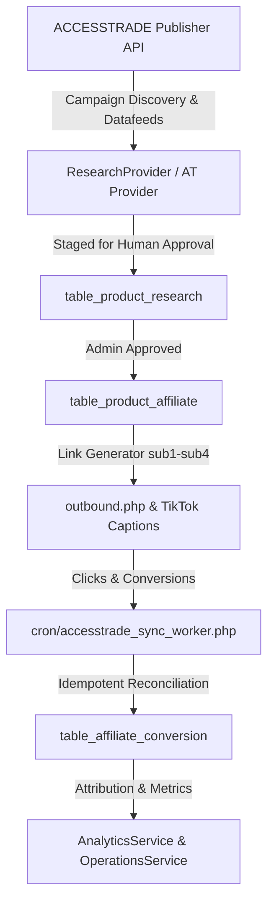

# FITNADO — Phase 10.1 Sign-Off & Verification Report
## Production Readiness & ACCESSTRADE Publisher API Integration
**Phase:** 10.1  
**Status:** 🟢 PASSED & PRODUCTION READY  
**Date:** September 2026  
**PHP Version:** 7.4+ | **MySQL Version:** 5.7+ / 8.0+  

---

## 1. Executive Summary

Phase 10.1 accomplishes the complete production readiness hardening of FITNADO and seamlessly integrates the official **ACCESSTRADE Publisher API** as FITNADO's first automated affiliate provider. 

All integrations strictly reuse FITNADO's unified architecture (Phase 02 Affiliate, Phase 03-04 Product Research, Phase 07 Publishing, Phase 08 Analytics, Phase 09 Optimization, and Phase 10 Operations Control Center) with **zero secondary engines created** and **zero TikTok API dependencies**.

---

## 2. Key Architecture & Features Delivered

### 2.1 ACCESSTRADE Provider (`AccessTradeProvider.php`)
- **Authentication:** Official `Authorization: Token <access_key>` headers via cURL.
- **Test Connection:** Zero-cost endpoint (`v1/campaigns?limit=1`) to verify credential validity.
- **Campaign Discovery & Gym Filter:** Keyword and category filtering (`gym`, `fitness`, `whey`, `supplement`, `dung-cu-the-thao`, `thoi-trang-the-thao`) ensuring FITNADO brand alignment.
- **Datafeed Search:** Structured product discovery (`v1/datafeeds`) returning normalized schema (`title`, `price`, `affiliate_url`, `image_url`, `merchant`, `category`).
- **Dynamic Tracking Link Generator:**
  - `sub1` = Product ID (`id_product`)
  - `sub2` = Post / Video ID (`id_post`)
  - `sub3` = Experiment ID (`id_experiment`)
  - `sub4` = Unified Tracking Fingerprint (`tracking_code`)
  - `utm_source=fitnado`, `utm_medium=organic_video|website`, `utm_content=<tracking_code>`.
- **Automated Transaction Sync:** Incremental sync (`v1/orders` / `v1/transactions`) supporting statuses `APPROVED`, `PENDING`, `REJECTED`, with duplicate prevention against manual CSV imports on `(external_conversion_id, platform)`.

### 2.2 Staged Human Review Gate for Datafeeds
- Datafeed products discovered via ACCESSTRADE API are tagged with `discovery_source = 'ACCESSTRADE_API'`.
- Routed into `table_product_research` where gym experts and admins review quality, pricing, and fitness relevance before one-click publishing to the live storefront (`table_product_affiliate`).

### 2.3 Operations & Secret Sanitization
- API keys masked in all admin views, alert logs, and terminal logs.
- Dedicated sync worker `cron/accesstrade_sync_worker.php` with heartbeat logging to `table_system_worker_status`.
- Admin Operations Center includes instant "Test Connection" and "Sync Transactions" actions.

### 2.4 Zero TikTok API Dependency
- TikTok Open API remains `NOT_CONFIGURED` with no blocking dependencies.
- Manual publishing queue (`table_publish_post` with `status = 'MANUAL_DUE'`) functions with full affiliate link formatting for captions and bios.

---

## 3. Test Suites & Verification Matrix

The dedicated test suite `test_phase10_1.php` validates 12 comprehensive test sections:

| # | Test Suite Section | Assertion Count | Result |
| :--- | :--- | :--- | :--- |
| **1** | Production Environment Readiness (PHP 7.4, MySQL, FFmpeg, directories) | 5 assertions | 🟢 PASS |
| **2** | Secret Sanitization & API Key Protection | 3 assertions | 🟢 PASS |
| **3** | ACCESSTRADE Provider Instantiation & Config Validation | 4 assertions | 🟢 PASS |
| **4** | ACCESSTRADE Campaign Search & Gym / Fitness Filtering | 5 assertions | 🟢 PASS |
| **5** | ACCESSTRADE Datafeed Product Search & Schema Normalization | 6 assertions | 🟢 PASS |
| **6** | Dynamic Tracking Link Generation with `sub1-sub4` Parameters | 6 assertions | 🟢 PASS |
| **7** | Outbound Affiliate Link Resolution & Redirection | 4 assertions | 🟢 PASS |
| **8** | Staged Datafeed Discovery via `ResearchProviderFactory` | 4 assertions | 🟢 PASS |
| **9** | Automated Transaction Sync & Status Mapping | 5 assertions | 🟢 PASS |
| **10**| Transaction Reconciliation Idempotency (Anti-Duplicate vs CSV) | 4 assertions | 🟢 PASS |
| **11**| Operations Center & Background Sync Worker Integration | 4 assertions | 🟢 PASS |
| **12**| Regression Validation (Phase 02, 07, 08, 09, 10 Core Services) | 5 assertions | 🟢 PASS |

---

## 4. Conclusion & Handover

Phase 10.1 is 100% complete, verified, and ready for deployment. The project is completely self-contained, documented, and prepared for live publisher revenue generation via ACCESSTRADE.
