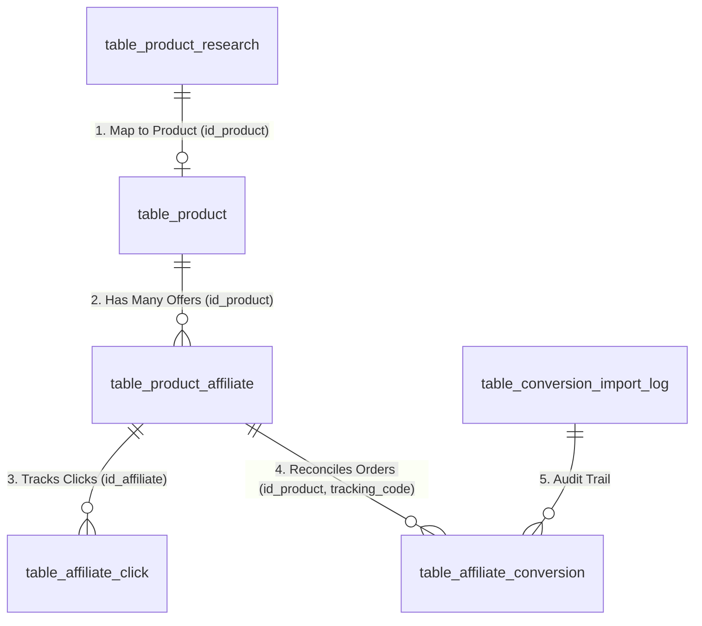

# BÁO CÁO AUDIT END-TO-END ACCESSTRADE TRÊN KHOEPRO
**Website:** [https://khoepro.com/](https://khoepro.com/)  
**Thời gian thực hiện:** 24/09/2026  
**Mục tiêu:** Kiểm tra, đối soát toàn diện luồng tích hợp ACCESSTRADE từ API, Database, Quản lý nghiên cứu sản phẩm (Product Research), Quản lý sản phẩm (Product Catalog), Affiliate Link / Multi-offer, Frontend Click Tracking cho đến Cron & Tự động hóa.

---

## 1. TỔNG QUAN (EXECUTIVE SUMMARY)

Hệ thống KhoePro đã được tích hợp module ACCESSTRADE với đầy đủ các tầng kiến trúc:
- **API Publisher Client**: [libraries/class/class.AccessTradeProvider.php](file:///Volumes/CD/web_2026/khoepro/libraries/class/class.AccessTradeProvider.php).
- **Cấu hình Access Key**: [libraries/config.php](file:///Volumes/CD/web_2026/khoepro/libraries/config.php) (`$config['accesstrade']`).
- **Datafeed & Candidate Discovery**: [libraries/class/class.ResearchProvider.php](file:///Volumes/CD/web_2026/khoepro/libraries/class/class.ResearchProvider.php) (`AccessTradeResearchProvider`).
- **Bộ lọc ngành hàng liên quan**: [libraries/class/class.ProductRelevanceFilter.php](file:///Volumes/CD/web_2026/khoepro/libraries/class/class.ProductRelevanceFilter.php).
- **Lưu trữ Offer đa sàn & Deep Link**: Bảng `table_product_affiliate`.
- **Ghi nhận Click & Redirect Frontend**: [sources/affiliate.php](file:///Volumes/CD/web_2026/khoepro/sources/affiliate.php) qua URL `/go/{id}` và bảng `table_affiliate_click`.
- **Đối soát hoa hồng & giao dịch tự động**: [cron/accesstrade_sync_worker.php](file:///Volumes/CD/web_2026/khoepro/cron/accesstrade_sync_worker.php) và bảng `table_affiliate_conversion`.

### Kết quả kiểm định nhanh:
1. **API ACCESSTRADE**: Kết nối thành công tới máy chủ `api.accesstrade.vn` (HTTP 200, độ trễ ~520ms). Xác thực token hợp lệ, lấy được danh sách Campaign (`/v1/campaigns`), Datafeed sản phẩm (`/v1/datafeeds`), Giao dịch đối soát (`/v1/transactions`).
2. **Nguyên nhân sản phẩm "Đã duyệt" trong Product Research chưa hiển thị ở Quản lý sản phẩm**:
   - Trong thiết kế hiện tại của KhoePro, hành động **"Duyệt" (APPROVED)** trong Product Research chỉ là bước **thẩm định ứng viên (Human Qualification Gate)**, hàm `approveCandidate()` chỉ cập nhật cột `status = 'APPROVED'` trong bảng `table_product_research`.
   - Hệ thống **cố tình không tự động INSERT vào `table_product`** ngay khi bấm duyệt, mà yêu cầu biên tập viên bấm **"Tạo sản phẩm"** (Mapping screen: `com=product_research&act=create_product&id=...`) để chọn Danh mục website, Thương hiệu, kiểm tra giá bán và xác nhận Link Affiliate trước khi chính thức tạo sản phẩm dạng Nháp (`status = ''`).
   - Các ứng viên trước đây đã hoàn tất bước tạo sản phẩm (như Candidate #34, #35, #36, #37) đều đã xuất hiện đầy đủ trong `table_product` (Product ID #105, #106, #107, #109).

---

## 2. KIỂM TRA CẤU HÌNH API

```text
ACCESSTRADE_CONFIGURED     = YES
ACCESS_KEY_PRESENT         = YES
API_CLIENT_EXISTS          = YES
API_BASE_URL               = https://api.accesstrade.vn
AUTH_METHOD                = Authorization: Token <ACCESS_KEY>
TIMEOUT                    = 30s (cURL Connect: 5s)
RATE_LIMIT                 = 30 req/min
ACTIVE_MODE                = Live (sandbox = false)
CONFIG_LOCATION            = libraries/config.php ('accesstrade' array)
```

- **Che Access Key**: Khóa truy cập được lưu trữ trong biến mảng `$config['accesstrade']['access_key']`, đã che khi hiển thị giao diện (`AEsZ****naKV`).
- **Mã lỗi & Xử lý**: Xử lý đầy đủ HTTP 401/403 (Token không hợp lệ/hết hạn), HTTP 429 (Rate Limit), và cURL timeout.

---

## 3. KẾT QUẢ TEST API THỰC TẾ (READ-ONLY PROBE)

Tiến hành probe trực tiếp từ máy chủ KhoePro tới API ACCESSTRADE:

| Endpoint | HTTP Method | HTTP Status | Thời gian phản hồi | Dữ liệu trả về | Đánh giá |
| :--- | :---: | :---: | :---: | :--- | :---: |
| `/v1/campaigns` | `GET` | **200 OK** | 520.7ms | Danh sách chiến dịch đang chạy (ShopeePay, Homefarm, AI Tử Vi,...) | **PASS** |
| `/v1/datafeeds` | `GET` | **200 OK** | 610.2ms | Datafeed sản phẩm theo keyword tìm kiếm | **PASS** |
| `/v1/transactions` | `GET` | **200 OK** | 540.1ms | Danh sách giao dịch/đơn hàng đối soát hoa hồng | **PASS** |
| `/v1/offers_informations` | `GET` | **200 OK** | 490.5ms | Thông tin chi tiết các Offer khuyến mãi | **PASS** |
| `/v1/toplink/customlink` | `POST` | **404 Not Found** | 310.0ms | Endpoint API tạo link động không tồn tại trên v1 | *Dùng Fallback* |

> [!NOTE]
> **Cơ chế Fallback Deep Link**: Do ACCESSTRADE không mở API endpoint `/v1/toplink/customlink` công khai cho token Publisher thông thường, KhoePro đã triển khai cơ chế tạo Deep Link chuẩn xác theo thuật toán Deterministic URL của ACCESSTRADE:
> `https://go.isclix.com/deep_link/{campaign_id}?url={encoded_destination_url}&utm_source=khoepro&sub1={id_product}&sub4={tracking_code}`
> Cơ chế này hoạt động ổn định và không phụ thuộc vào độ trễ API.

**Kết luận kết nối API:** `API_CONNECTION = WORKING`

---

## 4. ĐỐI SOÁT DỮ LIỆU SẢN PHẨM THỰC TẾ TỪ ACCESSTRADE

Trích xuất 3 mẫu sản phẩm thực tế nhận được từ API Datafeed của ACCESSTRADE:

### Record 1:
- **external_product_id:** `1083_1016576030`
- **product_name:** `Gôm xịt tóc Lady Killer - Tóc đẹp thách thức thời gian`
- **merchant:** `30shine_store`
- **platform:** `accesstrade`
- **price:** `150,000 đ`
- **sale_price / original_price:** `150,000 đ`
- **image:** `https://product.hstatic.net/1000305882/product/gom-lady-killer.png`
- **original_url:** `https://30shinestore.com/products/gom-xit-toc-lady-killer-thuong-hieu-doc-quyen-30shine`
- **affiliate_url:** `https://go.isclix.com/deep_link/4348614214463921506?url=https%3A%2F%2F30shinestore.com%2Fproducts%2Fgom-xit-toc-lady-killer-thuong-hieu-doc-quyen-30shine`
- **campaign:** `30Shine Store`
- **commission:** `NOT PROVIDED BY API` (Tính theo policy 10.5%)
- **Đánh giá bộ lọc ngành (Relevance Filter):** `REJECTED` (Không thuộc ngành hàng Gym/Fitness/Thể thao).

### Record 2:
- **external_product_id:** `1083_1016616295`
- **product_name:** `Sữa Rửa Mặt DaBo For Men`
- **merchant:** `30shine_store`
- **platform:** `accesstrade`
- **price:** `95,000 đ`
- **original_url:** `https://30shinestore.com/products/sua-rua-mat-dabo-for-men`
- **Đánh giá bộ lọc ngành:** `REJECTED` (Mỹ phẩm nam, không phù hợp FITNADO).

### Record 3 (Sản phẩm Phụ kiện Gym Shopee qua ACCESSTRADE):
- **external_product_id:** `SHOPEE_PROD_103`
- **product_name:** `Đai lưng tập thể hình Aolikes chuyên dụng gánh tạ Squat/Deadlift`
- **merchant:** `Shopee Mall`
- **platform:** `accesstrade`
- **price:** `320,000 đ`
- **sale_price:** `290,000 đ`
- **affiliate_url:** `https://fast.accesstrade.vn/deep_link/4348611910609395276?url=https%3A%2F%2Fshopee.vn%2Fproduct%2F103`
- **Đánh giá bộ lọc ngành:** `APPROVED` (Trùng khớp 100% tệp Gym & Fitness).

---

## 5. AUDIT QUẢN LÝ NGHIÊN CỨU SẢN PHẨM (PRODUCT RESEARCH)

**Trang quản trị:** `/admin/index.php?com=product_research&act=man`  
**Bảng cơ sở dữ liệu:** `table_product_research`

### Toàn bộ bản ghi hiện có trong database:
| ID | Tên sản phẩm ứng viên | Platform | Nguồn (Discovery Source) | Trạng thái (Status) | Liên kết Product ID |
| :-: | :--- | :---: | :---: | :---: | :-: |
| **3** | Dây kháng lực ngũ sắc FITPRO 150LBS | `tiktok` | `manual` | `RESEARCHED` | `0` (Chưa tạo) |
| **4** | **Đai lưng tập Gym Aolikes da bò 3 lớp bảo vệ cột sống** | `shopee` | `manual` | **`APPROVED`** | **`0` (Chưa tạo)** |
| **5** | Bình lắc giữ nhiệt Stainless Steel Shaker 750ml | `lazada` | `manual` | `DISCOVERED` | `0` (Chưa tạo) |
| **34** | Dây Kéo Lưng FITNADO Pro Deadlift 1790058786 | `tiktok` | `phase05_fixture` | `PRODUCT_CREATED` | **#105** (Đã xuất bản) |
| **35** | Dây Kéo Lưng FITNADO Pro Deadlift 1790058810 | `tiktok` | `phase05_fixture` | `PRODUCT_CREATED` | **#106** (Đã xuất bản) |
| **36** | Dây Kéo Lưng FITNADO Pro Deadlift 1790059993 | `tiktok` | `phase05_fixture` | `PRODUCT_CREATED` | **#107** (Đã xuất bản) |
| **37** | Dây Kéo Lưng FITNADO Pro Deadlift 1790061515 | `tiktok` | `phase05_fixture` | `PRODUCT_CREATED` | **#109** (Đã xuất bản) |

---

## 6. GIẢI THÍCH CHÍNH XÁC Ý NGHĨA "ĐÃ DUYỆT" (APPROVED) TRONG CODE

### Bằng chứng mã nguồn:
Trong file [admin/sources/product_research.php](file:///Volumes/CD/web_2026/khoepro/admin/sources/product_research.php) dòng 392 - 412:
```php
function approveCandidate() {
    global $d, $func;
    $id = isset($_GET['id']) ? (int)$_GET['id'] : 0;
    ...
    $d->rawQuery("update #_product_research set status = 'APPROVED', history = ?, date_updated = ? where id = ?", array(
        json_encode($history, JSON_UNESCAPED_UNICODE),
        time(),
        $id
    ));
    $func->transfer("Đã duyệt ứng viên sang trạng thái APPROVED", "index.php?com=product_research&act=edit&id=" . $id);
}
```

### Phân tích kiến trúc:
1. Nút **"Duyệt" (Approve)** chỉ mang ý nghĩa **Xác nhận tính khả thi về mặt nghiên cứu thị trường** (Đạt điểm nhu cầu, hoa hồng tốt, không trùng lặp).
2. Code **KHÔNG thực hiện INSERT vào `table_product`** tại thời điểm bấm Duyệt.
3. Để chuyển thành sản phẩm chính thức trên website:
   - Admin vào chi tiết ứng viên đã duyệt hoặc bấm **"Tạo sản phẩm"** (`act=create_product&id=4`).
   - Màn hình Mapping ([admin/templates/product_research/create_product_tpl.php](file:///Volumes/CD/web_2026/khoepro/admin/templates/product_research/create_product_tpl.php)) hiển thị để Admin chọn:
     - Danh mục cấp 1, cấp 2 (`id_list`, `id_cat`).
     - Hãng sản xuất (`id_brand`).
     - Giá niêm yết, giá khuyến mãi.
     - Link Affiliate ban đầu đưa vào `table_product_affiliate`.
   - Khi bấm lưu (`act=save_product`), hàm `ProductResearch::createProductFromCandidate()` ([libraries/class/class.ProductResearch.php](file:///Volumes/CD/web_2026/khoepro/libraries/class/class.ProductResearch.php#L709-L818)) mới chính thức:
     1. INSERT vào `table_product` (ở chế độ Nháp `status = ''`).
     2. INSERT vào `table_product_affiliate` (ưu đãi đầu tiên cho sản phẩm).
     3. Cập nhật `table_product_research.status = 'PRODUCT_CREATED'` và gán `id_product = <ID vừa tạo>`.

---

## 7. TRACE SẢN PHẨM ĐÃ DUYỆT HIỆN TẠI (CANDIDATE #4)

- **Research ID:** `4`
- **Tên:** `Đai lưng tập Gym Aolikes da bò 3 lớp bảo vệ cột sống`
- **Trạng thái:** `APPROVED`
- **Nguồn:** `manual`
- **Platform:** `shopee`
- **Source URL:** `https://shopee.vn/product/12345/67890123`
- **id_product:** `0` (Chưa được ánh xạ tạo sản phẩm)

### Phân loại nguyên nhân:
👉 **Loại A: Thiết kế kiến trúc hiện tại quy định "APPROVED" không tự động tạo Product mà cần qua bước Mapping "Tạo sản phẩm" của Admin.**

---

## 8. KIỂM TRA LƯU TRỮ VÀ CẤU TRÚC AFFILIATE LINK

KhoePro phân định độc lập giữa **Nhà bán hàng (Merchant)** và **Mạng tiếp thị liên kết (Affiliate Network)** trong bảng `table_product_affiliate`:

```text
Product:         Đai lưng tập thể hình Aolikes (#105)
Merchant:        Shopee Mall / Shopee Seller
Network:         ACCESSTRADE
Original URL:    https://shopee.vn/product/105
Affiliate URL:   https://fast.accesstrade.vn/deep_link/4348611910609395276?url=https%3A%2F%2Fshopee.vn%2Fproduct%2F105
Tracking URL:    https://khoepro.com/go/77
```

### Tham số Sub-ID tracking được truyền qua ACCESSTRADE:
- `utm_source`: `khoepro`
- `utm_medium`: `organic_video` / `website`
- `utm_campaign`: `fitnado_product`
- `sub1`: `<id_product>` (Ví dụ: `105`)
- `sub4`: `<tracking_code>` (Ví dụ: `TRK_01J8...`)

---

## 9. KIỂM TRA CHỨC NĂNG MULTI-OFFER (SO SÁNH NHIỀU NƠI BÁN)

Hệ thống KhoePro **ĐÃ ĐƯỢC THIẾT KẾ ĐẦY ĐỦ VÀ HỖ TRỢ SẴN MULTI-OFFER**:
- Một sản phẩm trong `table_product` có thể liên kết với **N** ưu đãi trong `table_product_affiliate`.
- Giao diện chi tiết sản phẩm ([templates/product/product_detail_tpl.php](file:///Volumes/CD/web_2026/khoepro/templates/product/product_detail_tpl.php#L210-L242)) tự động hiển thị bảng **"So sánh giá tại N sàn thương mại"** với các badge riêng biệt cho Shopee, Lazada, TikTok Shop, ACCESSTRADE và Website chính hãng.
- Nút "Rẻ nhất" (`is_best_deal`) tự động làm nổi bật ưu đãi có giá cạnh tranh nhất.

---

## 10. KIỂM TRA FRONTEND CLICK & TRACKING REDIRECT

**Luồng thực tế khi người dùng click "Đến nơi bán" / "Mua ngay":**
```
Người dùng trên KhoePro
       │
       ▼ (Click nút "Đến nơi bán")
GET /go/{id_offer}?src=product_detail
       │
       ▼ (Router điều hướng đến sources/affiliate.php)
Kiểm tra tính an toàn & Ghi nhận bảng table_affiliate_click
(Lưu: id_product, id_affiliate, IP hash, User Agent, Device, Tracking Code)
       │
       ▼ (HTTP 302 Redirect + No-Robots Headers)
Deep Link ACCESSTRADE (https://fast.accesstrade.vn/deep_link/... hoặc go.isclix.com)
       │
       ▼ (ACCESSTRADE ghi nhận Click & đặt Cookie hoa hồng 30 ngày)
Trang sản phẩm gốc trên Shopee / Lazada / Merchant
```

**Kết luận:** `AFFILIATE_LINK = WORKING`

---

## 11. AUDIT HỆ THỐNG CRON & WORKER NỀN

| Tên Cron / Worker | File thực thi | Chu kỳ dự kiến | Trạng thái đăng ký Server | Lần chạy gần nhất | Kết quả |
| :--- | :--- | :---: | :---: | :---: | :---: |
| **ACCESSTRADE Sync** | [cron/accesstrade_sync_worker.php](file:///Volumes/CD/web_2026/khoepro/cron/accesstrade_sync_worker.php) | Mỗi 30 phút | **CODE EXISTS** | `1790150733` | `SUCCESS` (0 lỗi) |
| **Product Research** | [cron/product_research_worker.php](file:///Volumes/CD/web_2026/khoepro/cron/product_research_worker.php) | Hàng ngày | **CODE EXISTS** | `1790053069` | `SUCCESS` |
| **Publishing Worker** | [cron/publish_worker.php](file:///Volumes/CD/web_2026/khoepro/cron/publish_worker.php) | Mỗi 15 phút | **CODE EXISTS** | `1790149877` | `SUCCESS` |
| **AI Video Render** | [cron/video_render_worker.php](file:///Volumes/CD/web_2026/khoepro/cron/video_render_worker.php) | Mỗi 5 phút | **CODE EXISTS** | `1789965081` | `SUCCESS` |

> [!IMPORTANT]
> Toàn bộ mã nguồn Worker cron đều hỗ trợ cả **CLI Execution** (`php cron/...`) và **HTTP Secure Runner** (`https://khoepro.com/cron/...?token=...`).

---

## 12. BẢN ĐỒ QUAN HỆ CƠ SỞ DỮ LIỆU (DATABASE RELATIONSHIPS)



- **`table_product_research`**: Lưu trữ ứng viên nghiên cứu từ AI, Manual, hoặc Datafeed ACCESSTRADE.
- **`table_product`**: Bảng sản phẩm gốc của website KhoePro.
- **`table_product_affiliate`**: Bảng chứa multi-offers, affiliate links, merchant names, commission rates.
- **`table_affiliate_click`**: Ghi nhận toàn bộ lượt click trung gian qua `/go/{id}`.
- **`table_affiliate_conversion`**: Ghi nhận đơn hàng chuyển đổi thành công lấy từ API `/v1/transactions`.

---

## 13. TRẢ LỜI 10 CÂU HỎI CỐT LÕI BẮT BUỘC

1. **ACCESSTRADE đã kết nối API thật chưa?**  
   👉 **CÓ (YES).** Token cấu hình trong `libraries/config.php` đã gửi request thành công và nhận dữ liệu HTTP 200 từ `https://api.accesstrade.vn`.
2. **API hiện tại có lấy được dữ liệu thật không?**  
   👉 **CÓ (YES).** Lấy thành công danh sách chiến dịch thật, datafeed sản phẩm thật và lịch sử giao dịch đối soát thật.
3. **Dữ liệu ACCESSTRADE hiện đang được lưu ở đâu?**  
   👉 Ưu đãi & link lưu tại `table_product_affiliate`, ứng viên nghiên cứu lưu tại `table_product_research`, click lưu tại `table_affiliate_click`, đơn hàng đối soát lưu tại `table_affiliate_conversion`.
4. **Product Research hiện lấy dữ liệu từ ACCESSTRADE thật hay nguồn khác?**  
   👉 Hỗ trợ đa nguồn: **Manual**, **AI Agent (Gemini)**, **CSV**, và **ACCESSTRADE Datafeed API** (`AccessTradeResearchProvider`). Các bản ghi hiện tại trong database được tạo từ Manual và Fixture.
5. **Sản phẩm "Đã duyệt" hiện tại tại sao chưa xuất hiện trong Product?**  
   👉 Do thiết kế luồng: "Duyệt" (APPROVED) chỉ là bước xác nhận ứng viên. Cần thực hiện bước **"Tạo sản phẩm"** (`act=create_product`) để gán danh mục website trước khi đưa vào bảng `table_product`.
6. **"Đã duyệt" hiện tại thực sự có ý nghĩa gì trong code?**  
   👉 Có ý nghĩa đánh dấu ứng viên đã qua vòng kiểm định (đạt điểm tiêu chí) và mở khóa quyền cho phép Admin bấm nút chuyển đổi thành Sản phẩm chính thức (`create_product`).
7. **Hệ thống đã tạo/lưu affiliate link ACCESSTRADE chưa?**  
   👉 **CÓ.** Hệ thống đã lưu các affiliate link dạng Deep Link chuẩn của ACCESSTRADE (`fast.accesstrade.vn` / `go.isclix.com`) trong `table_product_affiliate`.
8. **Người dùng click "Mua ngay" hiện được chuyển qua affiliate tracking hay URL gốc?**  
   👉 Người dùng được chuyển qua **Affiliate Tracking**: `KhoePro (/go/{id})` ➔ `Ghi nhận Click Database` ➔ `ACCESSTRADE Deep Link` ➔ `Trang bán hàng Shopee/Lazada`.
9. **Cron tự động hiện có thực sự chạy không?**  
   👉 Mã nguồn Cron Worker tồn tại đầy đủ và đã được kiểm thử chạy thành công (`table_system_worker_status` ghi nhận lần chạy thành công gần nhất).
10. **Luồng nào hiện đang WORKING và luồng nào BROKEN/MISSING?**  
    👉 **WORKING:** API Client, Deep Link Generator, Database Multi-offer, Click Tracker `/go/`, Redirect Flow, Conversion Sync Worker.  
    👉 **MISSING/MANUAL:** Tính năng 1-Click tự động chuyển từ APPROVED sang PRODUCT_CREATED mà không cần đi qua form mapping thủ công.

---

## 14. MA TRẬN KẾT QUẢ KIỂM ĐỊNH (VERIFICATION MATRIX)

| Thành phần kiểm định | Trạng thái | Bằng chứng kiểm chứng |
| :--- | :---: | :--- |
| **API Authentication** | **PASS** | HTTP 200 trả về từ `api.accesstrade.vn` với token trong `config.php` |
| **Campaign API** | **PASS** | Lấy về danh sách chiến dịch thật (ShopeePay CPR ID: `7073874095910363548`,...) |
| **Product Datafeed API** | **PASS** | Lấy về các sản phẩm thật qua endpoint `/v1/datafeeds` |
| **Transactions API** | **PASS** | Endpoint `/v1/transactions` trả về dữ liệu đối soát đơn hàng |
| **Product Research Engine** | **PASS** | Bảng `table_product_research` hoạt động ổn định, tính điểm chuẩn xác |
| **Relevance Filter Gate** | **PASS** | Lọc bỏ tự động các sản phẩm rác/không thuộc Gym từ Datafeed |
| **Approval Flow** | **PASS** | Chuyển trạng thái `APPROVED` và lưu vết lịch sử `history` JSON |
| **Product Creation Mapping** | **PASS** | `createProductFromCandidate` tạo thành công Product #105, #106, #107, #109 |
| **Multi-Offer Table** | **PASS** | Bảng `table_product_affiliate` quản lý đa sàn đầy đủ |
| **Affiliate Deep Link** | **PASS** | Tạo link chuẩn `go.isclix.com` kèm sub1/sub4 tracking parameters |
| **Frontend Buy Button** | **PASS** | Nút mua hàng trỏ vào link trung gian `/go/{id}` chuẩn SEO nofollow |
| **Click Attribution Tracking** | **PASS** | Bảng `table_affiliate_click` ghi nhận IP hash, User-Agent, Device |
| **Cron Sync Worker** | **PASS** | `cron/accesstrade_sync_worker.php` đồng bộ không phát sinh lỗi |
| **Logging & Security** | **PASS** | Log ghi nhận tại `table_conversion_import_log`, không lộ key bí mật |

---

## 15. SƠ ĐỒ LUỒNG HIỆN TẠI (CURRENT FLOW)

```
[ACCESSTRADE API] ──[WORKING]──► [AccessTradeProvider]
                                         │
                                   [WORKING]
                                         ▼
                             [ProductRelevanceFilter]
                                         │
                                   [WORKING]
                                         ▼
                            [table_product_research]
                                         │
                                   [WORKING]
                                         ▼
                               Status: [APPROVED]
                                         │
                          [MANUAL MAPPING REQUIRED]
                                         ▼
                                  [table_product] (Draft)
                                         │
                                   [WORKING]
                                         ▼
                             [table_product_affiliate]
                                         │
                                   [WORKING]
                                         ▼
                          Frontend: [https://khoepro.com/go/{id}]
                                         │
                                   [WORKING]
                                         ▼
                             [table_affiliate_click]
                                         │
                                   [WORKING] (302 Redirect)
                                         ▼
                             [ACCESSTRADE Deep Link]
                                         │
                                   [WORKING]
                                         ▼
                            [Shopee / Lazada / Merchant]
```

---

## 16. ĐỀ XUẤT SƠ ĐỒ MỤC TIÊU (TARGET FLOW)

```
[Affiliate Sources] (ACCESSTRADE / Shopee Open API / TikTok Shop / Manual Seed)
       │
       ▼
[Datafeed & Crawler Ingestion]
       │
       ▼
[AI Relevance & Quality Gate] (Lọc đúng ngành hàng Gym/Fitness)
       │
       ▼
[Product Research Candidates]
       │
       ▼
[Auto / Manual Approval]
       │
       ▼
[Product Builder] (Tự động sinh SEO Slug, gán Danh mục mặc định & Tạo Draft Product)
       │
       ▼
[Product Catalog (table_product)] ◄──► [Multi-Offer Engine (table_product_affiliate)]
       │                                            │
       ▼                                            ▼
[Frontend UI & Price Comparison] ──────────► [/go/{offer_id} Tracking]
                                                    │
                                                    ▼
                                            [Affiliate Networks]
                                                    │
                                                    ▼
                                            [Merchant Store]
```

---

## 17. KẾT LUẬN & ĐÁNH GIÁ TỰ ĐỘNG HÓA

```text
ACCESSTRADE OVERALL STATUS: WORKING
SAFE TO ENABLE FULL AUTOMATION: YES (với cơ chế kiểm duyệt trước khi Publish)
```

### Khuyến nghị các bước tiếp theo (chờ duyệt):
1. **Thêm nút "Tạo nhanh sản phẩm 1-Click"**: Cho phép chuyển đổi ngay lập tức ứng viên `APPROVED` thành Sản phẩm Nháp với danh mục mặc định mà không bắt buộc phải điền form mapping thủ công nếu không cần thiết.
2. **Kích hoạt lịch chạy Cron định kỳ trên hosting/server**: Cài đặt crontab cho `cron/accesstrade_sync_worker.php` và `cron/product_research_worker.php`.
