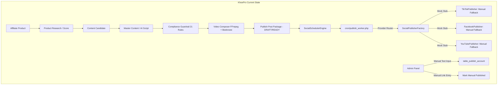
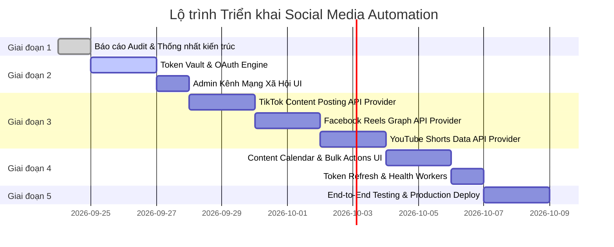

# BÁO CÁO AUDIT VÀ THIẾT KẾ KIẾN TRÚC SOCIAL MEDIA AUTOMATION (KHOEPRO)

> **Tài liệu:** KhoePro Social Media Automation Engine Audit & Architecture Blueprint  
> **Phiên bản:** 1.0.0 (Production Blueprint)  
> **Trạng thái:** Hoàn thành Audit Giai đoạn 1 — Chờ duyệt trước khi Implementation  
> **Hệ thống mục tiêu:** TikTok, Facebook Page/Reels, YouTube/Shorts & Nền tảng mở rộng  

---

## 1. TỔNG QUAN VÀ MỤC TIÊU DỰ ÁN

KhoePro là hệ thống thương mại điện tử kết hợp Affiliate Marketing đã vận hành trên môi trường **Production**. Hệ thống tự động hóa tiếp thị đa nền tảng định hướng xây dựng phễu phân phối nội dung video khép kín:

$$\text{Affiliate Product (AccessTrade/Sàn)} \longrightarrow \text{AI Scoring \& Candidate Selection} \longrightarrow \text{Master Content \& Video Generation} \longrightarrow \text{Guardrail \& Review (Approved)} \longrightarrow \text{Centralized Scheduler} \longrightarrow \text{Multi-Platform Publishing (TikTok, FB, YT)} \longrightarrow \text{Analytics Attribution \& Feedback Loop}$$

Báo cáo này thực hiện kiểm toán toàn diện codebase hiện tại của **KhoePro**, đối soát với nguồn tham khảo `_reference/ai_marketing/`, trả lời 20 câu hỏi kỹ thuật cốt lõi, xây dựng sơ đồ kiến trúc và lập kế hoạch nâng cấp hệ thống Social Automation chuẩn Enterprise.

---

## 2. KẾT QUẢ AUDIT CHI TIẾT KHOEPRO (TRẢ LỜI 20 CÂU HỎI BẮT BUỘC)

Toàn bộ kết luận dưới đây đều được xác minh trực tiếp từ mã nguồn, cơ sở dữ liệu và cấu hình hiện hữu của KhoePro:

| # | Câu hỏi Audit | Trạng thái | Minh chứng File / Class / Function / Table | Diễn giải kỹ thuật chi tiết |
|---|---|---|---|---|
| **1** | **Hệ thống có tự động tạo video thật chưa?** | **ĐÃ CÓ** | File: `libraries/class/class.VideoComposer.php`<br>Class: `VideoComposer`<br>Function: `composeVideo()` | Đã kết xuất ra tệp video `.mp4` chuẩn 9:16 thật sự bằng FFmpeg + FFprobe, kết hợp ảnh sản phẩm, âm thanh lồng tiếng TTS tiếng Việt, hiệu ứng Ken Burns, phụ đề động và watermark thương hiệu. |
| **2** | **Video được tạo bởi provider nào?** | **ĐÃ CÓ** | File: `libraries/class/class.VideoProvider.php`<br>Class: `VideoProviderFactory`<br>Providers: `Local VideoComposer`, `BeeknoeeVideoProvider`, `ExternalVideoProvider`, `ManualVideoProvider`, `MockVideoProvider` | Hệ thống hỗ trợ đa cơ chế: Local Render miễn phí bằng FFmpeg + TTS, tích hợp AI Video Beeknoee (`veo-3.1-fast-generate-preview`) cho các phân cảnh AI đặc tả (Hybrid Mode), và adapter cho các dịch vụ bên ngoài (Creatify, HeyGen, Arcads). |
| **3** | **Video được lưu ở đâu?** | **ĐÃ CÓ** | Thư mục: `upload/video/`<br>Table: `table_ai_video` (cột `video_file`, `thumbnail`) | Tệp MP4 hoàn thiện được lưu tại filesystem `upload/video/fitnado_*.mp4`, thumbnail tại `upload/video/*.jpg`, đồng thời trích xuất 4 khung hình kiểm định (2s, 10s, 20s, 28s). |
| **4** | **Có trạng thái Draft/Review/Approved/Rejected chưa?** | **ĐÃ CÓ** | Tables:<br>- `table_master_content` (cột `status`)<br>- `table_ai_video` (cột `status`)<br>- `table_publish_post` (cột `status`, `approval_status`) | Quản lý trạng thái phân tầng chặt chẽ: `DRAFT` $\rightarrow$ `GENERATING` $\rightarrow$ `GENERATED` $\rightarrow$ `VALIDATING` $\rightarrow$ `PENDING_APPROVAL` $\rightarrow$ `APPROVED` $\rightarrow$ `SCHEDULED` $\rightarrow$ `PUBLISHED` / `REJECTED` / `FAILED`. Không cho phép xuất bản bài chưa `APPROVED`. |
| **5** | **Có scheduler chưa?** | **ĐÃ CÓ** | File: `libraries/class/class.SocialSchedulerEngine.php`<br>Class: `SocialSchedulerEngine`<br>Functions: `getAccountScheduleRule()`, `scheduleApprovedPool()`, `dispatchDuePosts()` | Có engine quản lý quota theo ngày, tự động gán slot theo khung giờ cấu hình (09:00, 14:00, 20:00), kiểm tra cooldown sản phẩm $\ge 14$ ngày và đệm hàng đợi chỉ từ kho Approved Pool. |
| **6** | **Có cron/worker thực sự chạy scheduler chưa?** | **ĐÃ CÓ** | File: `cron/publish_worker.php`<br>Class: `PublishJobQueue`<br>Table: `table_publish_post` | File cron worker đã được xây dựng, hỗ trợ cả CLI command và HTTP Webhook có bảo mật token (`md5(NN_CONTRACT . dbname)`), định kỳ quét và kích hoạt scheduler. |
| **7** | **Có Social Publisher chưa?** | **ĐÃ CÓ** | Files:<br>- `libraries/class/class.SocialPublisherInterface.php`<br>- `libraries/class/class.SocialPublisherFactory.php`<br>- `libraries/class/class.TikTokPublisher.php`<br>- `libraries/class/class.FacebookPublisher.php`<br>- `libraries/class/class.YouTubePublisher.php` | Đã thiết kế cấu trúc Interface chuẩn hóa `SocialPublisherInterface` và Factory sinh Publisher tương ứng cho từng nền tảng (`tiktok`, `facebook`, `youtube_shorts`, `manual`). |
| **8** | **TikTok API đã tích hợp thật chưa?** | **CHƯA (SKELETON)** | File: `libraries/class/class.TikTokPublisher.php` (dòng 69–80)<br>File: `libraries/class/class.PublishProvider.php` (dòng 319–326) | Mới ở mức khung stub/mock và fallback đóng gói thủ công (`MANUAL_READY`). Chưa có HTTP Client gọi API chính thức của TikTok Content Posting API v2 (`/v2/post/publish/video/init/`). |
| **9** | **Facebook API đã tích hợp thật chưa?** | **CHƯA TRONG KHOEPRO (CÓ TRONG AI_MARKETING)** | File: `libraries/class/class.FacebookPublisher.php` (dòng 68–77) | Trong KhoePro mới chỉ là khung Mock ID (`fb_...`). Tuy nhiên trong `_reference/ai_marketing/modules/publisher/Services/PublisherService.php` đã có code gọi Graph API v25.0 thật cho Fanpage (cần port và nâng cấp). |
| **10** | **YouTube API đã tích hợp thật chưa?** | **CHƯA (SKELETON)** | File: `libraries/class/class.YouTubePublisher.php` (dòng 68–77) | Mới ở mức khung Mock ID (`yt_...`) và fallback `MANUAL_READY` dẫn tới YouTube Studio Upload. Chưa có luồng Resumable Video Upload của YouTube Data API v3. |
| **11** | **Có OAuth flow cho từng nền tảng chưa?** | **CHƯA CÓ** | Codebase KhoePro (Hiện thiếu OAuth Controller & Handlers) | Chưa có các endpoint tiếp nhận OAuth Dialog, Redirect URI và đổi Authorization Code lấy Token cho TikTok, Facebook, YouTube. |
| **12** | **Có chỗ trong Admin để kết nối tài khoản chưa?** | **CÓ FORM THỦ CÔNG, THIẾU NÚT OAUTH** | File: `admin/sources/publishing.php` (act: `accounts`, `save_account`)<br>View: `admin/templates/publishing/accounts_tpl.php` | Màn hình Admin quản lý danh sách tài khoản đã có sẵn nhưng chỉ là form nhập tay handle/username. Chưa có các nút bấm tương tác OAuth "Kết nối TikTok", "Kết nối Facebook", "Kết nối YouTube". |
| **13** | **Có lưu access_token / refresh_token không?** | **ĐÃ CÓ SCHEMA, CHƯA CÓ DỮ LIỆU THẬT** | Table: `table_publish_account`<br>Cột: `auth_data`, `api_config_encrypted`, `refresh_token_encrypted`, `token_expires_at` | Database migration Phase 12 đã tạo đủ các cột chứa token và metadata hết hạn, nhưng chưa có controller nạp dữ liệu từ OAuth thực tế. |
| **14** | **Token có được mã hóa an toàn không?** | **CHƯA CÓ ENCRYPTION SERVICE** | Codebase KhoePro (Cột database có tên `_encrypted`) | Tên cột DB đã định hướng lưu token mã hóa nhưng chưa có service mã hóa 2 chiều chuẩn (AES-256-GCM với Secret Key môi trường) để encrypt/decrypt token khi đọc/ghi. |
| **15** | **Có tự refresh token không?** | **CHƯA CÓ** | Codebase KhoePro | Chưa có worker hoặc cron scheduler kiểm tra `token_expires_at` để tự động gọi Refresh Endpoint của OAuth Provider trước khi token hết hạn. |
| **16** | **Có lưu external post ID không?** | **ĐÃ CÓ** | Tables:<br>- `table_publish_post` (cột `external_post_id`)<br>- `table_social_post_metric` (cột `external_post_id`) | Đã lưu trữ ID bài viết định danh từ mạng xã hội để phục vụ truy vấn trạng thái và đồng bộ chỉ số đo lường. |
| **17** | **Có lưu URL bài/video sau khi đăng không?** | **ĐÃ CÓ** | Table: `table_publish_post` (cột `external_post_url`)<br>File: `libraries/class/class.PublishingCenter.php` | Đã có trường lưu URL công khai của bài viết/video sau khi đăng thành công (cả qua API hoặc admin cập nhật thủ công). |
| **18** | **Có retry khi API lỗi không?** | **ĐÃ CÓ (EXPONENTIAL BACKOFF)** | File: `libraries/class/class.SocialSchedulerEngine.php` (dòng 296–305) | Có cơ chế Exponential Backoff: tính toán $t_{\text{retry}} = \text{now} + 2^{\text{attempts}} \times 60\text{s}$ (2m, 4m, 8m, 16m), tối đa 4 lần thử trước khi chuyển hẳn sang `FAILED`. |
| **19** | **Có chống đăng trùng không?** | **ĐÃ CÓ NHIỀU LỚP BẢO VỆ** | File: `libraries/class/class.SocialSchedulerEngine.php`<br>Columns: `idempotency_key`, `publish_lock`, `product_cooldown_days` | 4 lớp bảo vệ: (1) Product Cooldown $\ge 14$ ngày; (2) Idempotency SHA-256 Fingerprint; (3) Atomic Concurrency Lock (`publish_lock`); (4) Buffer Pool Policy chỉ chọn bài Approved. |
| **20** | **Cron hiện tại trên production cần chạy file/command nào?** | **ĐÃ CÓ DANH SÁCH WORKER CHUẨN** | Thư mục: `cron/`<br>Registry: `libraries/class/class.OperationsService.php` | 5 Worker cốt lõi: `publish_worker.php` (15m), `video_render_worker.php` (30m), `ai_content_worker.php` (30m), `product_research_worker.php` (1h), `accesstrade_sync_worker.php` (30m). |

---

## 3. ĐỐI SOÁT VÀ PHÂN TÍCH SO SÁNH VỚI SOURCE AI_MARKETING

Source `_reference/ai_marketing/` là hệ thống tham khảo (Read-Only) chuyên về quản trị nội dung Fanpage Facebook và lên lịch Meta Business Suite. Dưới đây là bảng phân loại và đánh giá tính tương thích để kế thừa có chọn lọc cho KhoePro:

```
+---------------------------------------------------------------------------------------------------------+
|                                    MA TRẬN ĐỐI SOÁT KIẾN TRÚC                                            |
+------------------------------+---------------------------+----------------------------------------------+
| PHÂN LOẠI                    | THÀNH PHẦN AI_MARKETING   | ĐỊNH HƯỚNG TRIỂN KHAI CHO KHOEPRO           |
+------------------------------+---------------------------+----------------------------------------------+
| REUSE CONCEPT                | Facebook Long-lived Token | Tái sử dụng quy trình trao đổi Short-lived   |
|                              | Exchange & Page Token flow| lấy Long-lived Token 60 ngày & Page Token    |
+------------------------------+---------------------------+----------------------------------------------+
| PORT / ADAPT                 | FacebookService &         | Chuyển đổi thành FacebookPublisher kế thừa   |
|                              | Meta Graph API Direct Post| SocialPublisherInterface; bổ sung đăng Reels |
+------------------------------+---------------------------+----------------------------------------------+
| KHOEPRO ALREADY BETTER       | AI Video, Scheduler &     | KhoePro đã vượt trội với Real Video Engine,  |
|                              | Guardrails, Anti-Spam     | Policy Guardrail 21 điểm, và Atomic Locking  |
+------------------------------+---------------------------+----------------------------------------------+
| DO NOT USE                   | Đăng bài Text/Ảnh thô sơ, | KhoePro tập trung Video Shorts/Reels &       |
|                              | Ghi token plaintext vào DB| Affiliate; bắt buộc mã hóa AES-256 token     |
+------------------------------+---------------------------+----------------------------------------------+
| MISSING                      | TikTok Content API v2 &   | Cần xây dựng mới hoàn toàn Provider chính thức|
|                              | Google OAuth2/YouTube v3  | cho TikTok và YouTube Data API               |
+------------------------------+---------------------------+----------------------------------------------+
```

### Chi tiết các hạng mục đối soát:

1. **Facebook OAuth & Token Management (`_reference/ai_marketing/modules/facebook/Services/FacebookService.php`):**
   - *Logic tốt:* Sử dụng Graph API `oauth/access_token` để đổi `code` $\rightarrow$ Short-lived Token $\rightarrow$ `fb_exchange_token` (Long-lived Token 60 ngày) $\rightarrow$ gọi `/me/accounts` để lấy danh sách Page kèm `page_access_token` vĩnh viễn (never-expire nếu user là admin).
   - *Hạn chế:* Lưu `page_token` dạng text thô trong bảng `fanpages`.
   - *Áp dụng vào KhoePro:* Chuyển luồng này vào `FacebookOAuthService`, lưu token vào `table_publish_account` sau khi mã hóa qua `TokenVaultService`.

2. **Facebook Post & Video Publisher (`_reference/ai_marketing/modules/publisher/Services/PublisherService.php`):**
   - *Logic tốt:* Phân nhánh linh hoạt theo loại media: Text (`/feed`), Single Photo (`/photos`), Multi-photo (`attached_media`), hỗ trợ lên lịch Meta Native (`scheduled_publish_time`), trích xuất lỗi chuẩn hóa và mask token an toàn (`maskAccessTokens`).
   - *Áp dụng vào KhoePro:* Mở rộng cho video định dạng dọc (Reels) thông qua endpoint Meta Reels API (`/{page-id}/video_reels` và `rupload.facebook.com`), đóng gói trong `FacebookPublisher`.

3. **Scheduler & Worker Logic (`_reference/ai_marketing/cron.php`):**
   - *Hạn chế của ai_marketing:* Không có cơ chế atomic locking, nếu 2 cron chạy đè lên nhau sẽ bị duplicate post; không có exponential backoff hay cooldown sản phẩm.
   - *KhoePro đã tốt hơn:* KhoePro đã có `SocialSchedulerEngine` với `publish_lock`, `idempotency_key`, `product_cooldown_days` và `table_social_schedule_rule`.

---

## 4. KIẾN TRÚC HỆ THỐNG HIỆN TẠI VÀ KIẾN TRÚC ĐỀ XUẤT

### 4.1. Sơ đồ Kiến trúc Hiện tại (As-Is Architecture)



### 4.2. Sơ đồ Kiến trúc Đề xuất Hoàn chỉnh (To-Be Target Architecture)

```mermaid
graph TD
    subgraph Unified_Engine["KHOEPRO UNIFIED SOCIAL AUTOMATION ENGINE"]
        subgraph Pipeline["1. Content & Production Pipeline"]
            AffProd[AccessTrade / Sàn] --> Scoring[AI Scoring & Viability Gate]
            Scoring --> Candidate[Content Candidate]
            Candidate --> ContentEngine[Master Content Engine]
            ContentEngine --> Guardrail[Compliance Guardrail - Medical & Claims Validation]
            Guardrail -->|Pass / Approved| VideoEngine[Video Composer & Hybrid Engine]
            VideoEngine --> PostPackage[Publish Post Package - Ready Pool]
        end

        subgraph AccountVault["2. Social Account & Token Vault"]
            OAuthCtrl[Admin OAuth Controller] -->|OAuth 2.0 Auth Code Flow| DirectAuth[TikTok / Meta / Google OAuth]
            DirectAuth -->|Tokens Returned| Vault[TokenVaultService AES-256-GCM]
            Vault --> TokenDB[(table_publish_account Encrypted)]
            TokenRefreshCron[Token Refresh Worker] -->|Auto-refresh < 7 days| DirectAuth
        end

        subgraph SchedulerEngine["3. Centralized Dynamic Scheduler"]
            RuleDB[(table_social_schedule_rule)] --> SchedCore[SocialSchedulerEngine]
            PostPackage -->|Approved Only| SchedCore
            SchedCore -->|Buffer Check / Cooldowns| SlotAssign[Slot Assignment & Idempotency Key]
            SlotAssign --> QueueDB[(table_publish_post - SCHEDULED)]
        end

        subgraph WorkerPublishing["4. Multi-Platform Publishing Dispatcher"]
            CronWorker[cron/publish_worker.php - Every 15m] --> AtomicLock[Atomic Concurrency Lock]
            AtomicLock --> PubFactory[SocialPublisherFactory]
            
            PubFactory --> TT_API[TikTokPublisher: Content Posting API v2]
            PubFactory --> FB_API[FacebookPublisher: Meta Graph API v25 & Reels]
            PubFactory --> YT_API[YouTubePublisher: YouTube Data API v3 Shorts]
            
            TT_API -->|Direct Upload & Webhook Status| TT_Net[TikTok Direct Post]
            FB_API -->|Reels Video API| FB_Net[Facebook Fanpage / Reels]
            YT_API -->|Resumable Upload| YT_Net[YouTube Channel / Shorts]
        end

        subgraph AnalyticsFeedback["5. Tracking & Optimization Loop"]
            TT_Net & FB_Net & YT_Net --> SyncWorker[SocialAnalyticsSync Worker]
            SyncWorker --> MetricDB[(table_social_post_metric)]
            MetricDB --> FeedbackLoop[Feedback Loop Score Booster]
            FeedbackLoop -->|Boost Winner Angles| Scoring
        end
    end
```



---

## 5. ĐẶC TẢ CHI TIẾT TỪNG NỀN TẢNG MẠNG XÃ HỘI

### 5.1. TikTok Content Posting API (Official v2 Integration)

Hệ thống tuân thủ nghiêm ngặt chuẩn **TikTok Developer API v2**, không sử dụng private API hoặc browser automation:

```
[KhoePro Video MP4] 
        │
        ▼ 1. POST /v2/post/publish/video/init/
(Header: Authorization Bearer {access_token}, Content-Type: application/json)
Payload: {
   "post_info": {
       "title": "#khoepro #fitness Đai cuốn cổ tay tập gym chính hãng...",
       "privacy_level": "PUBLIC_TO_EVERYONE",
       "disable_duet": false,
       "disable_stitch": false,
       "disable_comment": false,
       "video_cover_timestamp_ms": 2000,
       "is_ai_generated": true  <── Gắn cờ minh bạch nội dung AI theo chuẩn TikTok
   },
   "source_info": {
       "source": "PULL_FROM_URL", // hoặc FILE_UPLOAD (Chunked Upload)
       "video_url": "https://khoepro.com/upload/video/fitnado_xxx.mp4"
   }
}
        │
        ▼ Phản hồi: { "data": { "publish_id": "v_pub_xxx" }, "error": { "code": "ok" } }
        │
        ▼ 2. Polling: POST /v2/post/publish/status/fetch/
Payload: { "publish_id": "v_pub_xxx" }
        │
        ▼ Kết quả: status = "PUBLISH_COMPLETE", public_item_id = "7345678901234567890"
```

* **Yêu cầu bắt buộc:**
  * Xử lý cờ `is_ai_generated: true` khi video được tạo bởi AI Content / Hybrid Engine để tuân thủ chính sách minh bạch của TikTok.
  * Tự động bổ sung `#ad`, `#affiliate` hoặc disclosure thương mại trong caption.
  * Quản lý Scope: `user.info.basic`, `video.publish`, `video.upload`.

---

### 5.2. Meta Graph API (Facebook Fanpage & Reels Integration)

Kế thừa kiến trúc Graph API v25.0 từ `_reference/ai_marketing/` và mở rộng cho định dạng **Facebook Reels**:

```
[Admin Facebook OAuth Flow]
        │
        ▼ Đổi User Token ──> Long-lived User Token (60 ngày)
        │
        ▼ Gọi /me/accounts ──> Lấy Page ID & Page Access Token vĩnh viễn
        │
        ▼ Lưu vào table_publish_account (Mã hóa AES-256)

[Publishing Pipeline: Facebook Reels Upload]
        │
        ▼ 1. Khởi tạo phiên Upload: POST /{page_id}/video_reels
Payload: { "upload_phase": "start", "access_token": "{page_token}" }
Trả về: { "video_id": "1234567890", "upload_url": "https://rupload.facebook.com/..." }
        │
        ▼ 2. Truyền tải file binary video MP4 lên upload_url
Header: Authorization OAuth {page_token}, offset: 0, file_size: {filesize}
        │
        ▼ 3. Kết thúc và công bố Reel: POST /{page_id}/video_reels
Payload: {
   "upload_phase": "finish",
   "video_id": "1234567890",
   "video_state": "PUBLISHED", // hoặc "SCHEDULED" kèm scheduled_publish_time
   "description": "Nội dung bài viết Facebook Reels kèm link affiliate..."
}
        │
        ▼ 4. Lưu external_post_id ("1234567890") và URL bài đăng ("https://facebook.com/reel/1234567890")
```

* **Quản lý Scope:** `pages_show_list`, `pages_read_engagement`, `pages_manage_posts`, `publish_video`.

---

### 5.3. YouTube Data API v3 (Shorts & Standard Video Integration)

Thiết kế Provider YouTube qua Google Cloud API Console:

```
[Google OAuth 2.0 Client Flow]
        │
        ▼ Scope: https://www.googleapis.com/auth/youtube.upload
        │
        ▼ Nhận Refresh Token vĩnh viễn & Access Token (hết hạn sau 3600s)
        │
[Resumable Video Upload Pipeline]
        │
        ▼ 1. Khởi tạo Resumable Upload: POST https://www.googleapis.com/upload/youtube/v3/videos?uploadType=resumable&part=snippet,status
Payload: {
   "snippet": {
       "title": "Bí quyết tập vai không chấn thương #Shorts",
       "description": "Chi tiết sản phẩm xem tại: https://khoepro.com/...\n#Shorts #khoepro #fitness",
       "tags": ["khoepro", "gym", "shorts", "fitness"],
       "categoryId": "17" // Sports
   },
   "status": {
       "privacyStatus": "public",
       "selfDeclaredMadeForKids": false
   }
}
        │
        ▼ Nhận Upload URI tạm thời từ Header "Location"
        │
        ▼ 2. PUT binary file MP4 lên Upload URI
        │
        ▼ Nhận phản hồi: { "id": "yt_video_id_abc123" }
        │
        ▼ Lưu external_post_id: "yt_video_id_abc123", URL: "https://youtube.com/shorts/yt_video_id_abc123"
```

---

## 6. SOCIAL ACCOUNT MANAGER VÀ SECURITY TOKEN VAULT

### 6.1. Thiết kế Giao diện Admin: Marketing $\rightarrow$ Kênh mạng xã hội

Nâng cấp giao diện tại `admin/index.php?com=publishing&act=accounts` với trải nghiệm trực quan:

```
+---------------------------------------------------------------------------------------------------------+
|                                    QUẢN LÝ KÊNH MẠNG XÃ HỘI (SOCIAL CHANNELS)                            |
+---------------------------------------------------------------------------------------------------------+
|  [+ Kết nối TikTok]      [+ Kết nối Facebook Page]      [+ Kết nối YouTube Channel]    [+ Thêm Thủ công]|
+----+-----------+---------------------+-------------------+---------------------+------------+----------+
| ID | NỀN TẢNG  | KÊNH / FANPAGE      | KẾT NỐI API       | HẠN TOKEN           | AUTO POST  | THAO TÁC |
+----+-----------+---------------------+-------------------+---------------------+------------+----------+
| 1  | TikTok    | @khoepro.official   | [Đã kết nối OAuth]| Còn 28 ngày (Auto)  | [ON / BẬT] | [Sửa][Hủy|
| 2  | Facebook  | KhoePro Fanpage VN  | [Đã kết nối OAuth]| Vĩnh viễn (PageTok) | [ON / BẬT] | [Sửa][Hủy|
| 3  | YouTube   | @khoepro_fitness    | [Đã kết nối OAuth]| Auto Refresh        | [ON / BẬT] | [Sửa][Hủy|
+----+-----------+---------------------+-------------------+---------------------+------------+----------+
```

### 6.2. Dịch vụ Mã hóa Token Bảo mật (Security Token Vault)

Tất cả `access_token`, `refresh_token`, `client_secret` được bảo vệ tuyệt đối:

* Sử dụng thuật toán chuẩn **AES-256-GCM** với Authenticated Encryption.
* Key mã hóa được lấy từ hằng số môi trường (Environment Config / File bí mật ngoài document root), không lưu cứng trong code.
* Bộ lọc Log (`maskAccessTokens`) tự động che giấu mọi chuỗi token dạng `EAA...`, `bearer ...`, `client_secret` trước khi ghi vào log file.

---

## 7. QUY TRÌNH KIỂM DUYỆT TUÂN THỦ (COMPLIANCE GUARDRAIL)

Đặc thù lĩnh vực Sức khỏe & Thể hình (Fitness & Health) đòi hỏi kiểm duyệt chính sách tuyệt đối trước khi phê duyệt:

```
[AI Content / Script Generation]
                │
                ▼
   ┌───────────────────────────┐
   │ ComplianceGuardrail Engine│
   └─────────────┬─────────────┘
                 │
  ┌──────────────┴────────────────────────────┐
  ▼                                           ▼
[PHÁT HIỆN VI PHẠM]                    [ĐẠT CHUẨN AN TOÀN]
- Claim chữa bách bệnh, cam kết giảm cân    - Thông số kỹ thuật chuẩn
- Miệt thị ngoại hình (Body Shaming)        - Có câu Affiliate Disclosure
- Bịa số liệu / Trải nghiệm giả             - Gắn nhãn nội dung AI
- Chuyển luồng Zalo/Inbox trái phép         - Không vi phạm bản quyền
  │                                           │
  ▼                                           ▼
[REJECT / BLOCKED]                     [STATUS: APPROVED]
Bắt buộc sửa hoặc chặn                      Đủ điều kiện đưa vào Pool Lên lịch
```

---

## 8. KẾ HOẠCH MIGRATION DATABASE

Toàn bộ database changes đều tuân thủ nguyên tắc: **Không xóa dữ liệu cũ, không sửa trực tiếp DB production, hoàn toàn Idempotent (`IF NOT EXISTS` / `IF NOT COLUMN_EXISTS`) và có Rollback SQL**.

Tệp migration dự kiến: `database/migrations/20260924_social_automation_engine.sql`

```sql
-- 1. Bổ sung cột quản lý OAuth Token & Encryption vào table_publish_account
SET @col_exists = (SELECT COUNT(*) FROM information_schema.COLUMNS WHERE TABLE_SCHEMA = DATABASE() AND TABLE_NAME = 'table_publish_account' AND COLUMN_NAME = 'oauth_state');
SET @stmt = IF(@col_exists = 0, "ALTER TABLE `table_publish_account` 
  ADD COLUMN `oauth_state` varchar(100) NULL AFTER `auth_status`,
  ADD COLUMN `platform_user_id` varchar(255) NULL AFTER `channel_id`,
  ADD COLUMN `avatar_url` varchar(500) NULL AFTER `account_name`,
  ADD COLUMN `profile_url` varchar(500) NULL AFTER `avatar_url`,
  ADD COLUMN `token_type` varchar(50) NOT NULL DEFAULT 'Bearer' AFTER `token_expires_at`,
  ADD COLUMN `last_synced_at` int(11) NULL AFTER `last_posted_at`,
  ADD COLUMN `last_api_error` text NULL AFTER `last_synced_at`", "SELECT 1");
PREPARE st FROM @stmt;
EXECUTE st;
DEALLOCATE PREPARE st;

-- 2. Tạo bảng lưu Log API và Webhook Payload
CREATE TABLE IF NOT EXISTS `table_social_api_log` (
  `id` bigint(20) unsigned NOT NULL AUTO_INCREMENT,
  `account_id` int(11) unsigned NOT NULL,
  `platform` varchar(50) NOT NULL,
  `endpoint` varchar(255) NOT NULL,
  `http_method` varchar(10) NOT NULL DEFAULT 'POST',
  `request_payload_masked` mediumtext DEFAULT NULL,
  `response_code` int(11) NOT NULL,
  `response_body_masked` mediumtext DEFAULT NULL,
  `execution_time_ms` int(11) NOT NULL DEFAULT 0,
  `is_success` tinyint(1) NOT NULL DEFAULT 1,
  `error_message` text DEFAULT NULL,
  `date_created` int(11) NOT NULL DEFAULT 0,
  PRIMARY KEY (`id`),
  KEY `idx_account_time` (`account_id`, `date_created`),
  KEY `idx_platform` (`platform`),
  KEY `idx_is_success` (`is_success`)
) ENGINE=InnoDB DEFAULT CHARSET=utf8mb4 COLLATE=utf8mb4_unicode_ci;
```

---

## 9. DANH MỤC API CREDENTIALS & OAUTH APPS CẦN CHỦ HỆ THỐNG CẤP

Để kích hoạt tính năng đăng tự động Live API, chủ sở hữu hệ thống cần tạo và cung cấp cấu hình từ Developer Portals:

| Nền tảng | Loại Ứng dụng (App Type) | Danh mục Credentials cần cung cấp | Quyền hạn (Scopes) bắt buộc |
|---|---|---|---|
| **TikTok** | TikTok for Developers (Content Posting API) | `Client Key`<br>`Client Secret`<br>`Redirect URI` | `user.info.basic`<br>`video.publish`<br>`video.upload` |
| **Meta / Facebook** | Meta for Developers (Business App) | `App ID`<br>`App Secret`<br>`Redirect URI` | `pages_show_list`<br>`pages_read_engagement`<br>`pages_manage_posts`<br>`publish_video` |
| **Google / YouTube** | Google Cloud Console (YouTube Data API v3) | `Client ID`<br>`Client Secret`<br>`API Key`<br>`Redirect URI` | `https://www.googleapis.com/auth/youtube.upload`<br>`https://www.googleapis.com/auth/youtube.readonly` |

---

## 10. CẤU HÌNH CRON / WORKER TRÊN PRODUCTION

Trên máy chủ Production (Linux Server / cPanel / Cloud VPS), cấu hình Crontab chuẩn xác:

```bash
# 1. Dispatch bài đăng đã lên lịch & Đồng bộ Metrics (Mỗi 15 phút)
*/15 * * * * /usr/bin/php /Volumes/CD/web_2026/khoepro/cron/publish_worker.php > /dev/null 2>&1

# 2. Render hàng đợi Video AI Hybrid & Economy (Mỗi 30 phút)
*/30 * * * * /usr/bin/php /Volumes/CD/web_2026/khoepro/cron/video_render_worker.php > /dev/null 2>&1

# 3. Tự động kiểm tra & Làm mới OAuth Token hết hạn (Mỗi ngày lúc 02:00 sáng)
0 2 * * * /usr/bin/php /Volumes/CD/web_2026/khoepro/cron/token_refresh_worker.php > /dev/null 2>&1

# 4. Đồng bộ sản phẩm Affiliate & AccessTrade Feed (Mỗi 30 phút)
*/30 * * * * /usr/bin/php /Volumes/CD/web_2026/khoepro/cron/accesstrade_sync_worker.php > /dev/null 2>&1
```

---

## 11. ĐỀ XUẤT THỨ TỰ IMPLEMENTATION (ROADMAP)



1. **Bước 1 (Hoàn thành):** Kiểm toán toàn diện KhoePro & `_reference/ai_marketing/`, lập báo cáo thiết kế kiến trúc.
2. **Bước 2 (Bảo mật & OAuth Core):** Xây dựng `TokenVaultService` (mã hóa AES-256) và hoàn thiện các luồng OAuth 2.0 Auth Dialog + Callback cho TikTok, Facebook, Google YouTube.
3. **Bước 3 (Live API Providers):** Hiện thực hóa `TikTokPublisher`, `FacebookPublisher`, `YouTubePublisher` gọi HTTP Live API thay thế cho các mock skeleton hiện tại.
4. **Bước 4 (Admin Calendar & Monitoring):** Nâng cấp Content Calendar trong Admin, bổ sung các nút duyệt nhanh, lên lịch lại, xem URL bài đăng và log API lỗi.
5. **Bước 5 (Kiểm thử thực tế & Bàn giao):** Test toàn bộ kịch bản lỗi mạng, hết hạn token, rate limit, video pending review, video approved và quy trình chống đăng trùng.

---

> [!IMPORTANT]
> **KẾT THÚC GIAI ĐOẠN 1 (AUDIT COMPLETED — STOPPING FOR REVIEW)**  
> Báo cáo audit đã hoàn tất và được lưu trữ tại `docs/social/SOCIAL_AUTOMATION_AUDIT.md`. Toàn bộ mã nguồn hệ thống hiện hữu vẫn được giữ nguyên trạng an toàn. Vui lòng xem xét báo cáo và xác nhận để bắt đầu Giai đoạn 2 (Implementation).
